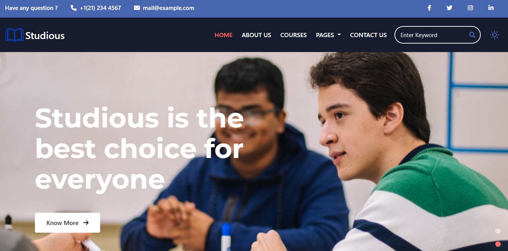

  
  

    <a href="https://bc04-nhom4-capstone-bootstrap.vercel.app/">View Demo</a>
    ·
    <a href="https://demo.w3layouts.com/demos_new/template_demo/13-03-2021/studious-liberty-demo_Free/425342591/web/index.html">Template</a>
  

 

  
  
Page

## Third Party plugin used except for HTML and CSS

-   [Bootstrap 4.6](https://getbootstrap.com/docs/4.6/getting-started/introduction/)
-   [TouchSwipe](http://www.github.com/mattbryson)
-   [BackTop](https://codyhouse.co/gem/back-to-top/)
-   [Counter-up](https://github.com/bfintal/Counter-Up)

## Description

-   Team of 3 people create template based website.
-   I'm code from the Header to Intro.
-   My branch is develop_phong93, Phuc (leader) helped me a lot edit CSS.
